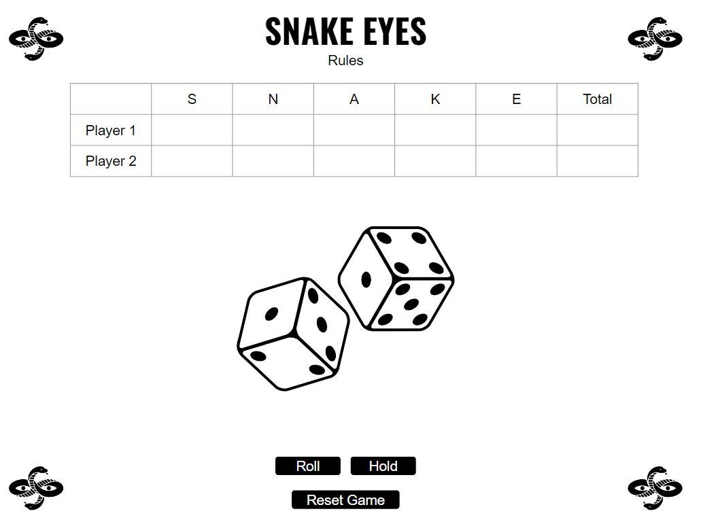

# Snake Eyes Dice Game | Amanda Putney

## [Play Game](https://amandaputney.github.io/snake-eyes/)

## Elevator Pitch
Do you feel lucky? _Well, do ya punk?_ If so, continue reading... 

The goal of this 2 player dice game is to get the most points.
There are 5 rounds of the game:

1- **S** \
2- **N** \
3- **A** \
4- **K** \
5- **E** 

**RULES:** For each turn, the current player rolls the dice. If they get any combination that doesn't include a 'snake eye' (a single pip on the die i.e. a die face with a value of one) they count their current points and have the option to keep rolling or end their turn. If their roll includes a single snake eye, they don't get any points for that turn. If their roll includes double snake eyes, they lose all accumulated points. 
The player with the most points in the 5th round wins.

## Tech Stacks
Javascript, HTML, CSS

## Wireframes

## MVP Goals
Render scoreboard

Show buttons for 'roll' and 'hold' with click events

Switch turns between two players

Generate 2 random numbers between 1 and 6 (1 number/die), when each player clicks 'roll' on their turn

Show points on the scoreboard for each player's turn

Design logic for winning & visually display which player won on the final round

Have the option to reset the game after the final round

## Stretch Goals

Display message to identify player turn

Display a message to announce the winner/tie

Dice animations

Dice roll audio

Make something ominous happen when a snake eye is rolled

## Potential Roadblocks

Executing the correct win logic

Organizing my code in a concise way
