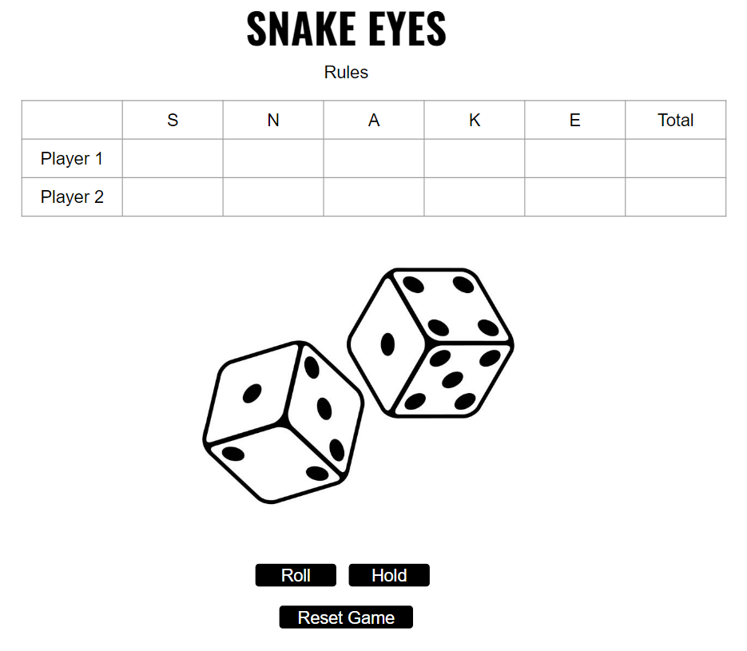

# Project 1 Pitch: Snake Eyes Dice Game | Amanda Putney

## Elevator Pitch
The goal of this 2 player dice game is to get the most points.
There are 5 rounds of the game:

1- S \
2- N \
3- A \
4- K \
5- E 

For each turn, the current player rolls the dice. If they get any combonation that doesn't include a 'snake eye' (a single pip on the die i.e. a die face with a value of one) they count their current points, and have the option to keep rolling or end their turn. If their roll includes a single snake eye, they don't get any points for that turn. If their roll includes double snake eyes, they lose all accumulated points. 
The player with the most points on the 5th round wins.

## Tech Stacks
Javascript, HTML, CSS

## Wire frames

## MVP GOals
Display a game in the browser

Switch turns between two players

Design logic for winning & visually display which player won

Include separate HTML / CSS / JavaScript files

Stick with KISS (Keep It Simple Silly) and DRY (Don't Repeat Yourself) principles

Use Javascript for DOM manipulation

Deploy  game online

Inlcude in game instructions on how to play

Use semantic markup for HTML and CSS (adhere to best practices)

Have a way to reset the game on game over that does not rely on a page refresh

## Stretch Goals

Dice animations

Dice roll audio

## Potential Roadblocks

Executing the correct win logic

Organizing my code in a concise way